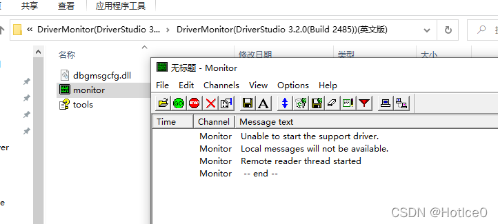
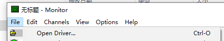
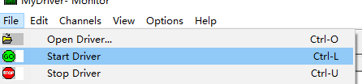
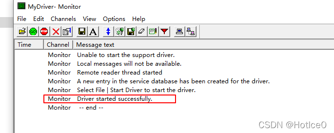
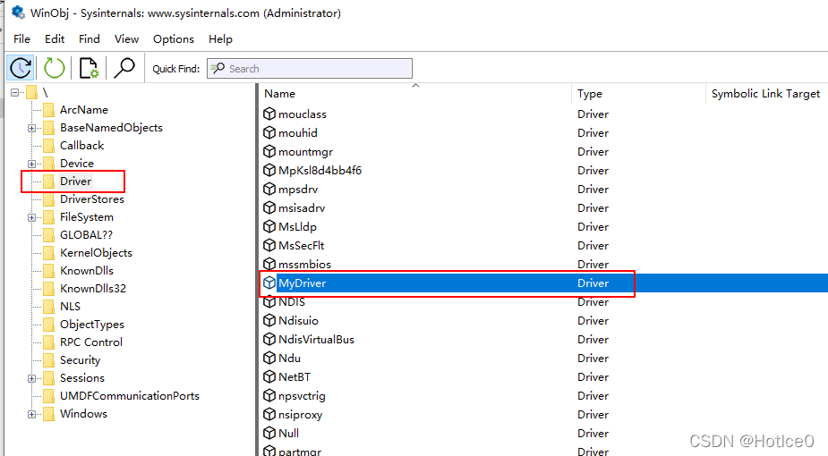

# 一、如何加载编译好的NT驱动
## 1.1环境
- 系统版本：win10 1909 64位虚拟机
- 用到的工具为DriverMonitor（书中建议的工具）
- 查看已经加载的驱动程的工具：winobj.exe 

DriverMonitor和winobj.exe都可以在这个仓库中`/FirstNTDriver/文件夹中`下载到：[https://github.com/HotIce0/windows_kernel_driver_learn_note](https://github.com/HotIce0/windows_kernel_driver_learn_note)

## 1.2 加载驱动
1. 关闭windows驱动强制签名验证（如果是win10必须做这一步）
> 具体方法可以百度
2. 按照书里面的打开DriverMonitor. 

3. 打开驱动文件

4. 运行驱动程序

## 1.3 使用winobj.exe查看已经加载的驱动程序
> 原书中说使用“设备管理器”查看，但是实测win10系统下无法通过该方式查看

1. 管理员运行Winobj.exe
2. 点击Driver，点击Name按名称排序，找到自己的驱动即可。

